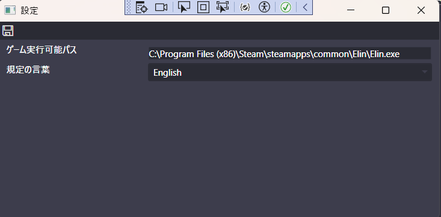
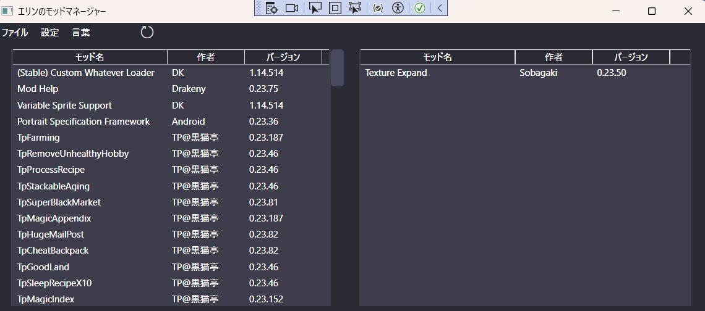

# ElinModManager

[Elin](https://store.steampowered.com/app/2135150/Elin/)のゲームにモッドマネージャーです。

色とUIは[LaughingLeaderさんのBG3ModManager](https://github.com/LaughingLeader/BG3ModManager)作品の根幹によって作られました。

# 使い方

## 設定

まずは設定を調整してください。

- **ゲーム実行可能パス**: エリンゲームの実行可能パスです。ボックスをクリックするとファイルダイアログは表示されたら、実行可能ファイルを選べてください。
- **既定の言葉**: アップリケーションを開く時に使う既定の言葉です。

## メーンウィンドウ

モッドマネージャーを使う前にゲームパスを設定は必要です。

**新しいダウンロードしたモッドを見える前にゲームをスタートは必要です。ゲームは自動に新しいモッドをロードオーダーに追加させます。**

更新アイコンを押すと、現在のロードオーダーは示します。

モッドを並べ替える為にドラッグとドロップしてください。左側のモッドは有効で、右側のモッドは無効です。

好きな並べるのを完成すると、セーブアイコンを推すとロードオーダーが保存されます。