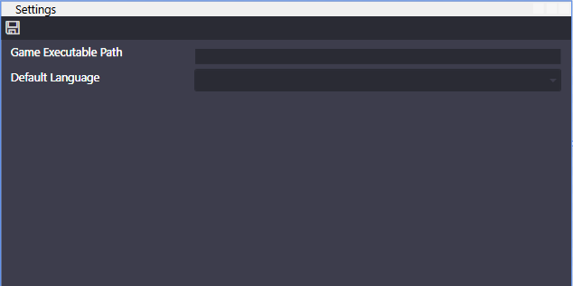
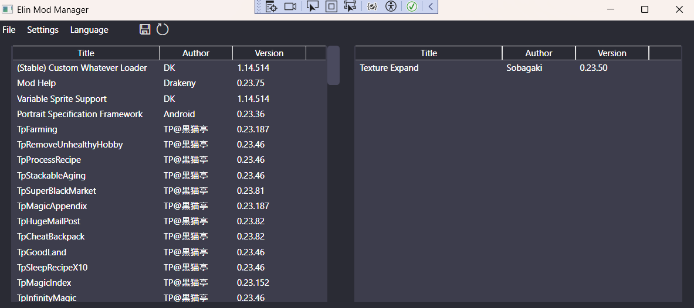

# ElinModManager

ì˙ñ{åÍî≈ÇÕ[DZÇøÇÁÇ≈Ç∑](README.jp.md)ÅB

A mod manager for the game [Elin](https://store.steampowered.com/app/2135150/Elin/).

UI and Colours based on [LaughingLeaders BG3ModManager](https://github.com/LaughingLeader/BG3ModManager)

# How to use

## Settings

First you should adjust your settings.

- **Game Path**: The path to your Elin game exuctuable. Click on the box to open a file dialog to select your executable file.
- **Default Language**: The default language the mod manager uses when opening.

## Main Window

The game path must be set before you can use the mod manager.

**To see newly added mods, you must load the game once to have it add the new mods to loadorder.txt**.

Pressing refresh will reorder the mods based on your current loadorder.txt file.

To order your mods, just drag and drop them how you want them to be ordered. Mods on the left side will be active, 
and mods on the right side will be inactive.

Once you have ordered them, pressing the save icon will export your load order.